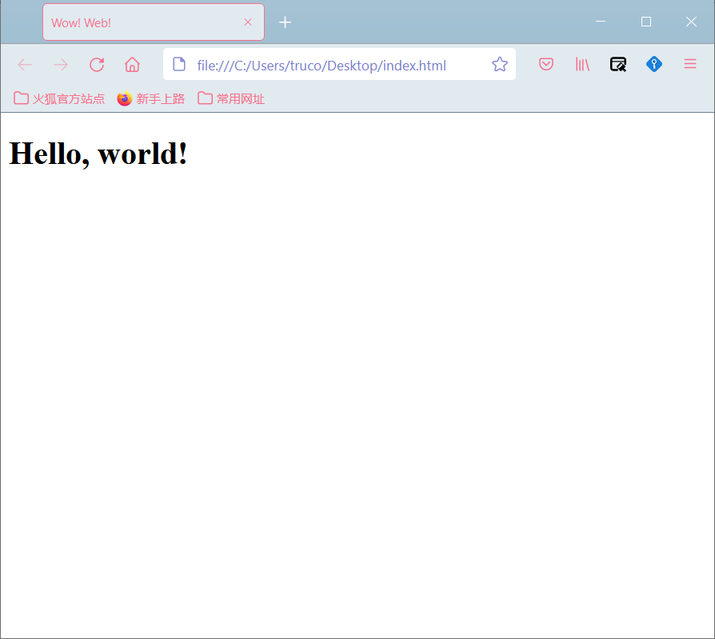

Welcome!

<!-- more -->

## Something Important

1. The author's English is very poor, if you find some grammar mistakes or typos, feel free to open a `pull request` to the [github repository](https://github.com/truc0/nimo.network).

2. The author is busy with school <del>and fish touching</del>. Please ask **Search Engine** first before contacting the author when you have any question.

3. Web Development is not difficult as `Calculus`, but still need tons of time since the term `web development` covers a large range of techniques.

## Pre-requirements

To get started, you would need a good text editor and a modern browser.

It is recommanded to install the latest version of `Chrome` or `Firefox`, but it is not necessary if you think the browser you are using is modern enough.

For editors, there are tons of choices:
- Visual Studio Code (Recommanded)
- Sublime
- Atom
- <del>Windows Text Editor</del>(just joking)

You can also use IDEs like:
- Webstorm
- Visual Studio

## Hello World Example

The content is still unavailable now due to the fact that the group mentor is guing.

The tutorial will keep updating during the 2021 Autumn Semester (in SJTU).

The following code is a simple element in html body. Try to create a `index.html` file and copy the following code into it. Then open the file with your favourite browser.

If you are using `Windows`, you can create a text file `index.txt` first and then rename it to `index.html`, there should be a warning but just ignore it.

If you are using `macOS` or `Linux` distributions, create the file by entering the following command in terminal:

```bash
touch index.html
```

Here's the html code:

```html
<!doctype html>
<html>
<head>
    <title>Wow! Web!</title>
</head>
<body>
    <h1>Hello, world!</h1>
</body>
</html>
```

The result should be something like this:


