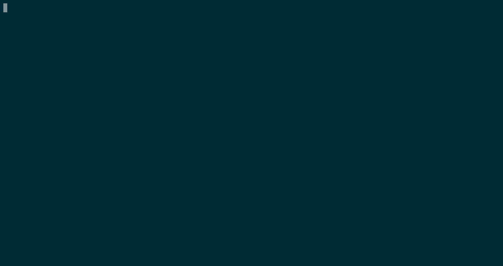

# 项目简介

NoteApp 是一个笔记软件，采用前后端分离的开发模式。

用户可以通过网页前端注册账户，并通过注册时的信息登录。
登录后可以看到自己创建的所有笔记（notes），同时支持新建、删除、编辑笔记。

后端已经有了原型，项目地址为[https://github.com/truc0/simple-noteapp](https://github.com/truc0/simple-noteapp)。
在开发前端的过程中，建议通过本文中的开发环境搭建指南或项目中的[README](https://github.com/truc0/simple-noteapp#readme)文件先行搭建好本地的后端环境。

## 技术栈

### 后端技术栈

后端采用了[Django](https://djangoproject.com)框架，这个框架提供了数据库管理等功能。
同时采用了[Django Rest Framework](https://www.django-rest-framework.org/)框架，这个框架主要用于构建符合`RESTful`风格的API。

### 前端技术栈

前端是NoteApp Lab需要完成的部分。

理论上，前端可以由任意工具构建，包括完全不使用自动化工具的手写HTML、CSS、JS的方法。
但是在本项目中推荐使用[Vue.js](https://cn.vuejs.org/)，你可以自己选择使用`2.x`版本或`3.x`版本。

> **Vue2 和 Vue3的区别**
>
> Vue3 新增了 Composition API 等功能，即提供了另外一种编写 Vue 应用的方式，但仍然兼容 Vue2 的 option API，即上学期曾经用过的那种。
> 然而 Vue3 的中文文档似乎还在编写，故现阶段仍然可以考虑使用 Vue2。

## 开发环境与相关库

本项目推荐使用[Vue CLI](https://cli.vuejs.org/zh/)作为项目初始化工具。相关教程如下：

- 安装：[https://cli.vuejs.org/zh/guide/installation.html](https://cli.vuejs.org/zh/guide/installation.html)
- 创建项目：[https://cli.vuejs.org/zh/guide/creating-a-project.html](https://cli.vuejs.org/zh/guide/creating-a-project.html)

**注意**：在安装项目时，可以通过方向键（`↑`，`↓`）移动光标，并使用空格键选中/取消当前光标所在的栏目，选择完毕后可以通过回车键进入下一步。
如果发现选择错误，可以按下`Ctrl+C`终止创建流程并重新创建。

推荐的项目配置为：
- 第一步选择Manually select features（手动选择特性）
- 第二步选择：
  + Babel
  + Router
  + Vuex
  + CSS Pre-processors
- 第三步选择`Vue 2.x`
- 第四步选择`Yes`
- 第五步选择`Sass/SCSS`
- 第六步选择`In dedicated config files`
- 第七步意为是否将当前选择保存为预设配置，这个可以随意
- 最后一步可以选择`Yarn`或`NPM`，不影响项目配置

然后就会进入漫长的安装流程。

**注意**：即使发现在配置过程中多选/少选了配置，也不一定要重头再来，可以上网自行搜索如何在项目中添加/删除该配置。

上述配置中，有几个工具是当前没有接触但是项目中大概率需要的：

1. **[Vuex](https://vuex.vuejs.org/zh/index.html)**：这是一个状态管理工具，
可以简单地把它理解成所有组件都可以访问的全局变量，适合存放用户信息等在不同层级都会使用的数据。
2. **[Vue Router](https://router.vuejs.org/zh/index.html)**：这是一个前端路由器（这里的路由和我们平常说的路由器不是一个东西）。
这个组件的主要作用是实现不同组件间的无刷新切换。

如果对上述软件完全没有概念，可以通过文档中提供的样例先作学习。

附上安装过程：


# 本地后端环境搭建

> 项目地址为[https://github.com/truc0/simple-noteapp](https://github.com/truc0/simple-noteapp)

**注意**：该项目的readme文档仍存在不足之处，如果遇到任何错误欢迎群里@。

## 下载源码

该项目的主要编程语言为`Python`，故运行该程序需要下载源码。

### 方法一：使用Git（推荐）

[Git](https://git-scm.org)是开发人员常用的版本管理工具。你可以在搜索引擎中找到相关安装教程。
如果想要较为系统地学习**Git**，那么推荐看[Learn Git Branching](https://learngitbranching.js.org/?locale=zh_CN)。

你可以用以下命令下载源码。

```bash
git clone https://github.com/truc0/simple-noteapp
```

**注意**：若访问Github的速度不佳，可以自行搜索国内的Github镜像以加速。

### 方法二：Zip方式下载

在[https://github.com/truc0/simple-noteapp](https://github.com/truc0/simple-noteapp)页面中，有一个绿色的按钮`Code`，
按下后有`Download ZIP`选项，点击即可下载。

解压后即可获得源码。

## 安装虚拟环境（可选）

一般而言，不同的应用程序依赖的库/包不一样。极端情况下，两个应用程序依赖的库/包会产生冲突。
这时可以通过安装虚拟环境解决这个问题。

### 创建虚拟环境

你可以通过如下命令创建一个虚拟环境，记得把`<path>`改为你要放置虚拟环境的目录。

```bash
python3 -m venv <path>
# python3 -m venv ./venv
```

### 激活虚拟环境

你可以通过如下命令在**当前Shell**中激活虚拟环境。

```bash
source <path>/bin/active
# source ./venv/bin/active
```

**注意**：以上命令仅适用于类`Unix`系统，Windows系统下的命令类似但不相同，可以自行搜索一下。

另一个**注意**：激活环境仅能作用于当前的窗口，重启/重开窗口后可能需要重新激活。

## 安装依赖

由于现阶段的相关问题，为了能够正常使用后端，需要安装`requirements.dev.txt`版本的依赖。
你可以通过以下命令安装所需依赖。请在输入命令之前确保当前目录是后端的源码目录。

```bash
pip install -r requirements.dev.txt
```

## 配置后端及初始化数据库

后端的配置并不复杂，主要文件为`noteapp/config.py`，你可以通过复制配置样例来配置后端。
下列命令将配置样例复制到配置文件中。请在输入命令之前确保当前目录是后端的源码目录。

```bash
cp noteapp/config.example.py noteapp/config.py
```

在开始之前应当适当更改配置。如：
- `DEBUG`选项应设置为`True`
- `SECRET_KEY`选项应设置为新生成的值，参考网站为：[https://djecrety.ir/](https://djecrety.ir/)
- `LOGGING`选项应设置为`None`

配置完文件后可以初始数据库。在这里我们使用的数据库为`sqlite3`，是一个基于单文件的数据库，
一般而言不需要额外安装软件即可使用。下列命令会初始化数据库。

```bash
python manage.py migrate
```

## 运行程序

`Django`框架提供了一个管理脚本，与项目有关的管理大部分都可以通过该脚本进行。下列命令会在`8000`端口运行后端程序。
请在输入命令之前确保当前目录是后端的源码目录。

```bash
python manage.py runserver
```

# Lab 1

本项目会分为若干部分，每个部分通过一个Lab的形式描述。本次Lab的目标是完成注册及登录的功能。

## API 简介

### 注册API

注册API为`/auth/register`，方法为`POST`，需要提供以下数据：

- email
- username
- password

### 登录API

登录API为`/auth/login`，方法为`POST`，需要提供以下数据：

- username
- password

如果登录成功，将会返回一个`Token`用于后续的鉴权。


